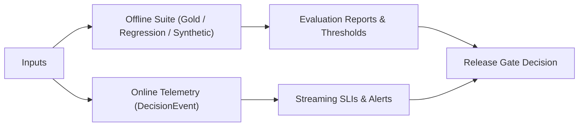
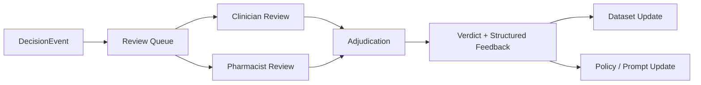
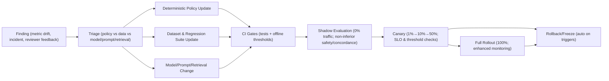
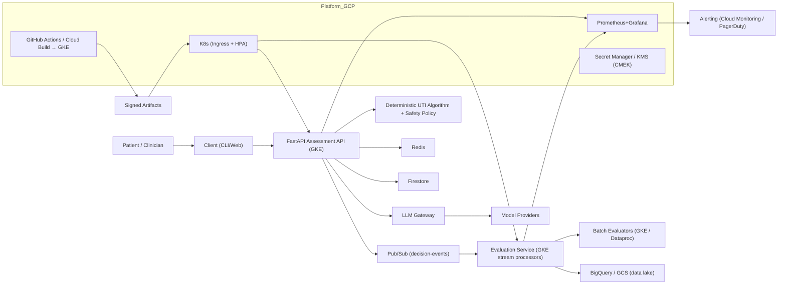
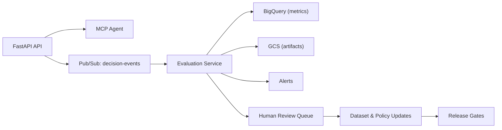
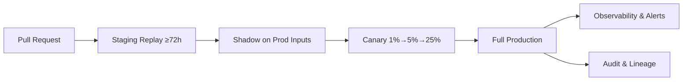

# Livewell: Evaluation and Improvement
---

## Q1 — How would you evaluate the LLM responses and clinical decisions over time?

- Dual-track evaluation: reproducible offline suites + real-time online telemetry.
- Offline: run against frozen models on versioned datasets to catch regressions deterministically.
  - Gold (≈5k): curated, adjudicated cases with ground truth decisions and rationale.
  - Regression (append-only): every past defect/incident becomes a permanent test.
  - Synthetic (≈5k): targeted edge cases and stress scenarios to probe safety and drift.
- Online: compute streaming SLIs from `DecisionEvent` (the structured record for each assessment: inputs, versions, outputs, timings, cost, policy checks).
  - Track p50/p95/p99 latency, TTFT, TTLT, safety violations, quality proxies, and drift by locale, cohort, and version.



| Dimension | Metric | Plain definition | Threshold |
|---|---|---|---|
| Safety | Safety adherence | Share of assessments with zero deterministic safety/policy violations; computed from DecisionEvent safety flags. | 0 violations (100%) |
| Correctness | Guideline concordance (CA/ON) | Proportion whose regimen, dose, frequency, and duration match locale‑specific CA/ON guidelines given renal status, pregnancy, and allergies. | ≥95% |
| Triage | Escalation appropriateness | Rate at which the agent escalates or abstains exactly per deterministic triage rules and clinician adjudication on red‑flag presentations. | ≥98% |
| Evidence | Citation faithfulness | Fraction of cited sources that are valid, recent, relevant, and support the corresponding claims (LLM precheck plus human sample). | ≥95% |
| Factuality | Unsupported‑claim rate | Percent of statements presenting clinical facts without verifiable evidence or contradicting trusted sources (lower is better). | ≤1–2% |
| Latency | End‑to‑end p95 / p99 | Wall‑clock time from request receipt to final assessment completion, including retrieval, policy checks, and streaming completion. | ≤6s / ≤12s |
| Streaming | TTFT p95; TTLT p95 | TTFT: time to first token from model start; TTLT: duration from first to last streamed token for the narrative output. | ≤1.5s; ≤4.5s |
| Cost | p95; p99 | Total per‑assessment cost (provider usage plus infrastructure estimates) recorded from billing proxies. | ≤$0.06; ≤$0.12 |
| Reliability | Parser compliance | Percentage of responses passing strict JSON schema validation without auto‑correction or retries. | ≥99% |
| Robustness | Fallback usage rate | Percentage of requests requiring fallback models/flows due to timeouts, validation failures, or low confidence. | ≤5% |
| UX | Conversation completion rate | Percentage of sessions that reach a final recommendation or disposition without abandonment. | ≥85% |
| UX | Satisfaction score | User‑reported satisfaction from post‑session survey. | ≥4.3/5 |

---

## Q2 — Who (human reviewers, doctors, patients) would you involve in the evaluation loop and how?

- Ownership: Clinical Governance Board (CMO, UTI lead, Pharmacist lead, Safety, Engineering, Compliance) provides release sign‑off.
- Reviewer scopes:
  - UTI clinicians: diagnosis, escalation, and rationale (appropriateness).
  - Pharmacists: regimen, dosing, contraindications, resistance patterns (CA/ON stewardship).
  - Patients: readability, comprehension, cultural fit (patient-facing clarity).
  - QA engineering: parser compliance, resilience tests, data quality audits.
- Workflow & SLAs:
  - Assignment within 2 business hours for flagged items; critical cases handled immediately.
  - Pharmacist review ≤ 24h; clinician review ≤ 48h; 10–20% double‑review with adjudication.
- Sampling strategy:
  - 100% review of policy overrides, escalations, and high‑risk cohorts.
  - Stratified + importance sampling (~1000/wk), oversampling low‑confidence and edge cases.
  - Patient feedback at 0h and 72h; adverse event hotline; longitudinal outcomes cohorts.



#### Automated rollback triggers (production)

| Metric | Threshold | Action | Owner |
|---|---|---|---|
| Safety adherence | > 0 violations in any cohort | Immediate rollback; incident and RCA | On‑call Engineer |
| End‑to‑end latency p99 | > 12s sustained 30m | Reduce traffic; scale; rollback | SRE |
| Parser compliance | < 99% for 15m | Route to fallback; fix parser; rollback if persists | Backend Engineer |
| Guideline concordance | < 95% in shadow/canary | Freeze rollout; clinician adjudication | Clinical Lead |
| Fallback usage rate | > 5% sustained 60m | Investigate provider/routing; switch tier | LLM Lead |

---

## Q3 — How would you use these evaluations to improve the agent’s quality and safety?

- Three levers, three time scales:
  - Deterministic safety policy (hours): encode non‑negotiable rules, override risky outputs, require cryptographic approvals.
  - Dataset evolution (days–weeks): add incidents to regression, expand underrepresented cohorts, include red‑team adversarials.
  - Model / prompt / retrieval (weeks): A/B with power analysis, clinical review, phased rollout (1%→10%→50%→100%).
- Hallucination control (layered):
  - Structural validation: drug, dose, duration against authoritative databases; cross‑plan consistency.
  - Evidence grounding: verify source validity, relevance, recency; escalate unverifiable claims.
  - Ensemble checks: safety, interaction, and explainer models flag disagreements for review.
- Measuring impact (beyond pass/fail):
  - Safety: adverse events prevented, near‑miss reduction.
  - Clinical: escalation appropriateness, reduced progression to severe infection.
  - Operational: override/reject rates, clinician time saved.

#### Phased rollout (1%→10%→50%→100%)

- Shadow evaluation (pre‑canary): run new version on recent production inputs with zero user impact; require non‑inferior safety and guideline concordance to baseline.
- Stage 1 — Canary 1% (24–72h):
  - Criteria to promote: 0 safety violations; p95 ≤ 6s and p99 ≤ 12s; parser compliance ≥ 99%; cost p95 ≤ $0.06; guideline concordance non‑inferior to baseline.
  - Rollback: any safety violation; p99 > 12s sustained 30m; parser compliance < 99% for 15m; fallback usage > 5% sustained 60m.
- Stage 2 — 10% (24–72h):
  - Criteria to promote: criteria above sustained; no material deltas by cohort/locale; cost within budget envelope.
  - Rollback: same triggers as Stage 1.
- Stage 3 — 50% (48–120h):
  - Criteria to promote: stability across peak periods; no alert fatigue; clinician spot checks pass.
  - Rollback: same triggers; add manual freeze if reviewer queue backlog grows > SLA.
- Stage 4 — 100% (first‑week enhanced monitoring):
  - Criteria: all prior criteria; incident‑free first 24h; alerts within SLOs; reviewer feedback non‑degrading.
  - Fallback plan: instant traffic reversion to prior version and freeze further deployments.
- Approvals: promotion requires on‑call engineer + clinical lead sign‑off; rollbacks are engineer‑initiated and auto‑approved.



Node key (Q3):
- CI Gates: unit/contract tests and offline eval suites must pass with thresholds met before traffic exposure.
- Shadow Evaluation: 0% traffic on real inputs; requires non‑inferior safety and guideline concordance to baseline.
- Canary: progressive traffic at 1% → 10% → 50% with promotion/rollback criteria and fixed monitoring windows.
- Full Rollout: 100% traffic with enhanced monitoring during the first week.
- Rollback/Freeze: immediate reversion and deployment freeze on safety/latency/parser/fallback triggers.

---

## Q4 — How would you engineer and deploy this eval+improvement system?

- Architecture: event‑driven evaluation service (streaming via Pulsar/Kafka/Google Pub/Sub). Each `DecisionEvent` captures inputs, versions, outputs, timings, cost, and policy checks.
- Promotion pipeline: PR → staging replay (≥72h) → shadow on production inputs → canary (1%→5%→25%) → full rollout with automatic rollback on safety, latency, or override regressions.
- Observability: OpenTelemetry traces (1% baseline; 100% on errors); dashboards for safety, quality, latency, drift; alerts on any safety violation or sustained p99 > 12s.
- Compliance: immutable audit logs, signed artifacts, data lineage; aligned to NIST AI RMF and FDA GMLP expectations.
- Cost controls: intelligent routing, caching, batching, spot compute; SLO‑aligned cost guardrails.

- Production deployment architecture:
  - Runtime: k8s with HPA autoscaling pods for `Assessment API`, `Evaluation Service`, `LLM Gateway`, and `Batch Evaluators`.
  - Traffic: Cloud Load Balancer → Ingress → API; mutual TLS and per‑service authn/z.
  - Messaging: Google Cloud Pub/Sub `decision-events` topic with dead‑letter subscription.
  - Storage: prefer fully managed GCP services
    - Primary DB: Firestore (document-first); Cloud SQL Postgres if relational schemas needed
    - Cache: Memorystore (Redis)
    - Object storage: Google Cloud Storage (GCS)
    - Analytics: BigQuery; optional Dataproc for heavy batch
  - CI/CD: GitHub Actions or Cloud Build → GKE deploy; image scanning; signed artifacts
  - Observability: Prometheus/Grafana; optional Weights & Biases
  - Security: Secret Manager, CMEK/KMS at rest; simple network policies; least-privilege service accounts
  - Reliability: multi‑zone GKE, scheduled backups, restore drills; basic circuit breakers/timeouts/rate limits

- Data governance & security:
  - PHI minimization; field‑level redaction in logs; differential access per role; retention windows with automatic purge.
  - Auditability: append‑only evaluation logs; artifact signing; lineage for datasets and models; reviewer identity with timestamps.
  - Compliance posture: region‑aware storage, encryption in transit/at rest (CMEK), periodic access reviews.

- Production readiness (ops):
  - Testing: schema/property‑based tests for `DecisionEvent`, regression packs, synthetic adversarial/stress suites, chaos/resilience probes.
  - Experiment governance: pre‑registered A/Bs with power analysis, stop rules, ethics/safety review for high‑risk changes.
  - Runbook: on‑call rotation, alert thresholds (see rollback table), rollback procedures, and weekly post‑release audits.


### Eval & improvement system overview

As detailed in Q1–Q3, the system emits `DecisionEvent`s, performs streaming and offline evaluations (see metrics in Q1), routes flagged cases for human review (roles in Q2), and gates releases via staged rollouts (pipeline below). Additions here include a review dashboard and an experimentation service for controlled A/B changes to prompts and flows.





| Gate | Inputs | Pass criteria | Blocks |
|---|---|---|---|
| Offline eval | Gold, regression, stress | All thresholds met; no regressions | Any safety failure |
| Shadow eval | Recent prod sample | No safety deltas; non‑inferior guideline fit | Any safety delta |
| Canary | 5% traffic, 24–72h | No alerts; stable SLOs | Safety alert; sustained p99 > 12s |

---

### Mini‑glossary (for clarity)

- `DecisionEvent`: canonical JSON record per assessment with inputs, versions, outputs, timings, cost, and policy checks.
- TTFT: time to first token (streaming responsiveness).
- TTLT: time to last token (streaming completion time).
- Shadow: run new version on real inputs without affecting users; compare deltas.
- Canary: gradually route a small % of traffic to a new version with auto‑rollback.
 - Phased rollout: staged traffic promotion (1%→10%→50%→100%) with fixed monitoring windows, promotion criteria, and rollback rules.

---

## Appendix

### Sample `DecisionEvent`

```json
{
  "id": "evt_2025-09-03T12:34:56Z_1234",
  "patient_context": {
    "age": 28,
    "sex": "female",
    "pregnancy_status": "unknown",
    "renal_function_summary": "normal"
  },
  "inputs": {
    "symptoms": {"dysuria": true, "urgency": true, "frequency": true},
    "red_flags": {"fever": false, "flank_pain": false}
  },
  "versions": {
    "assessment_algo": "v1.4.2",
    "prompt": "uti_assess_v7",
    "model": "gpt-5-UTI-2025-08-15"
  },
  "outputs": {
    "decision": "recommend_treatment",
    "regimen": {
      "agent": "Nitrofurantoin macrocrystals",
      "dose": "100 mg",
      "frequency": "PO BID",
      "duration": "5 days"
    },
    "rationale": [
      "No red flags; uncomplicated cystitis",
      "CA/ON guideline first‑line agent"
    ]
  },
  "safety": {"violations": []},
  "timings_ms": {"ttft": 520, "ttlt": 3100, "end_to_end": 5200},
  "cost_usd": 0.041,
  "policy_checks": {"parser_compliant": true, "guideline_fit": true},
  "region": "CA-ON"
}
```
