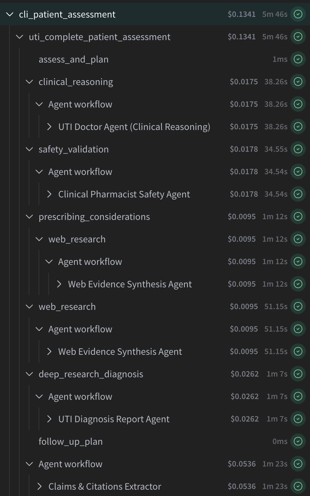
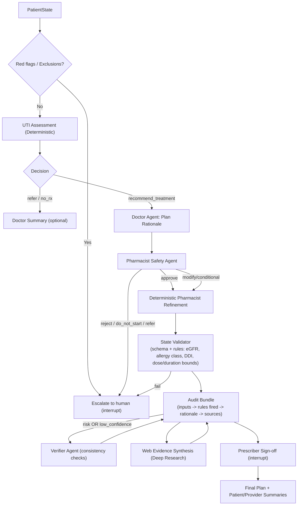
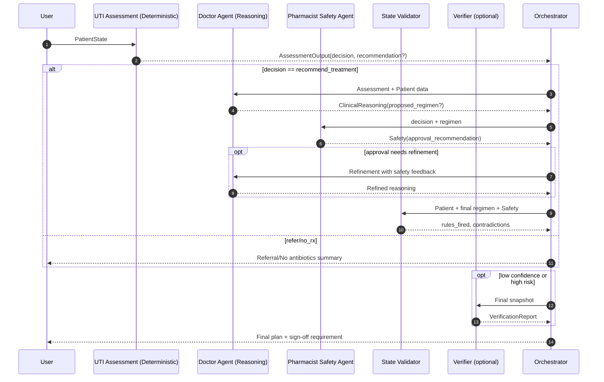
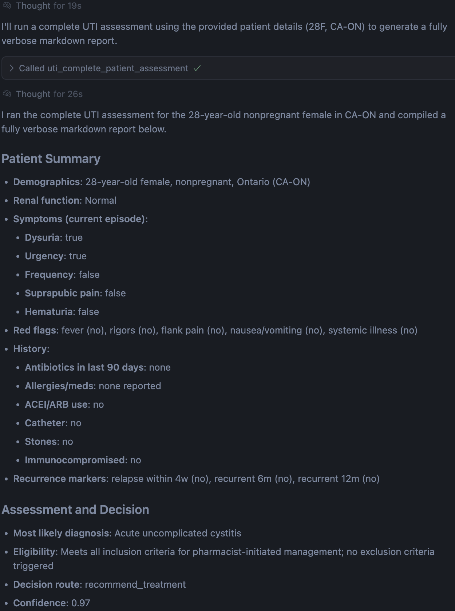

# UTI Assessment Platform

## Executive Brief
This UTI Assessment Platform is a production-ready system that combines deterministic clinical algorithms with advanced LLM agents to deliver fast, safe, and explainable UTI treatment decisions. The platform provides multiple interfaces (CLI, API, MCP server) and integrates comprehensive safety validation, real-time evidence synthesis, and complete audit trails for clinical workflows.

## Why it matters (problem → solution)
- **Problem**: UTIs are common, but frontline decisions can be slow, inconsistent, and hard to audit. Guidelines, resistance patterns, and safety constraints change frequently.
- **Solution**: A hybrid system where a deterministic algorithm makes the primary decision and LLM agents provide reasoning, safety validation, and current evidence—always bounded by hard safety gates.

## Safety & compliance at the core
- **Deterministic safety gates**: drug–drug interactions, contraindications, renal thresholds, dose/duration bounds
- **Mandatory human sign‑off**: outputs are drafts for prescriber approval
- **Immutable audit bundle**: inputs → rules fired → rationale → sources → versions
- **PHI protection** and stop conditions for high‑risk cohorts

## Evaluation and proof
- See the full evaluation framework: [Evaluation and Improvement](EVALUATION.md)
- Tracks safety adherence, guideline concordance, escalation appropriateness, latency, cost, and citation faithfulness with clear release gates.

## High‑level architecture
- **Multiple Interfaces**: CLI, REST API, and MCP server for different integration needs
- **Deterministic Core**: UTI assessment algorithm makes primary treatment decisions
- **LLM Intelligence Layer**: Agents provide clinical reasoning, safety validation, and evidence synthesis
- **Production Infrastructure**: Redis for rate limiting, FastAPI for scalable API, comprehensive observability
- **Complete Audit Trail**: Immutable audit bundles for compliance and continuous improvement
- **Safety-First Design**: Multiple validation layers with mandatory human sign-off

## 🔭 Observability & Tracing (W&B Weave)

We use W&B Weave's official OpenAI Agents SDK integration to capture end‑to‑end traces of the agentic workflow. Traces are grouped under a single parent operation so you can review the entire patient assessment as one run, with child nodes for each agent/tool call.

## 🗄️ Redis Integration

The platform uses Redis for production-ready features:

### Rate Limiting
- **API Rate Limiting**: Prevents abuse with configurable rate limits per endpoint
- **Concurrency Control**: Limits concurrent requests to prevent resource exhaustion
- **Distributed Locks**: Ensures thread-safe operations across multiple instances

### Caching
- **Response Caching**: Caches frequent assessment results for improved performance
- **Session Management**: Maintains user sessions and state across requests

### Setup Redis
```bash
# Start Redis container (recommended for development)
make redis-up

# Or install Redis locally
# macOS: brew install redis
# Ubuntu: sudo apt install redis-server

# Verify Redis is running
redis-cli ping  # Should return PONG
```

### Enable

Weave is initialized automatically when you run the CLI or demo if your environment has the standard variables set. The defaults work out‑of‑the‑box; cloud mode is used if `WANDB_API_KEY` is present, otherwise local mode.

```bash
# Required for LLM calls
export OPENAI_API_KEY=...

# Optional (cloud mode)
export WANDB_API_KEY=...                 # enables hosted dashboards
export WEAVE_PROJECT=utiplayground  # default used if unset

# Run any workflow – links will be printed to the console
uv run python -m src.cli --sample "Sarah Smith" --non-interactive --write-report
```

### What you’ll see

- Parent op: `cli_patient_assessment` (the whole CLI invocation)
- Child ops (agent/tool stages):
  - `uti_complete_patient_assessment`
  - `clinical_reasoning`
  - `safety_validation`
  - `web_research`
  - `deep_research_diagnosis`

Each node includes inputs/outputs, timing, errors (if any), and linkage back to the final report in `uti-cli/reports/`.

#### Dashboard snapshot using GPT 4.1



### Notes

- Tracing is integrated via Weave’s `WeaveTracingProcessor` per the official guide: `https://weave-docs.wandb.ai/guides/integrations/openai_agents/`.
- Runs are grouped so a single link represents the complete assessment chain. Console output will include the Weave dashboard URL.

#### Runtime flags (behavioral controls)

- `STRICT_INTERRUPTS` (default: `true`): Enforces hard interrupts at deterministic referral, safety reject/do_not_start/deny, and validator failures (high severity).
- `DOCTOR_SUMMARY_ON_REFERRAL` (default: `true`): When interrupting for `refer_*` or `no_antibiotics_not_met`, optionally invoke a brief Doctor Summary; disable to save cost.
- `PRESCRIBER_SIGNOFF_REQUIRED` (default: `true`): Marks outputs as requiring prescriber sign‑off; set to `false` to disable the flag.

---

## Appendix: Technical and Setup

## 🎯 Overview

This system implements a conversational AI agent that:
1. **Collects patient information** from structured inputs (demo cases or an external client)
2. **Diagnoses patients** using clinical algorithms for UTI assessment
3. **Recommends treatment/drugs** based on evidence-based protocols
4. **Provides safety validation** and clinical reasoning using advanced LLM capabilities

## 🏗️ Architecture

### Design Philosophy: Why a Hybrid Deterministic-Agentic Architecture?

Healthcare AI systems face a fundamental tension between two competing requirements. On one side, we need absolute reliability and safety guarantees that only deterministic systems can provide. On the other, we need the flexibility, explainability, and contextual understanding that modern LLMs excel at delivering. Our hybrid architecture resolves this tension by separating concerns: deterministic algorithms handle safety-critical decisions, while LLM agents provide the intelligence layer for communication, verification, and evidence synthesis.

**Core Design Principles:**

- **Safety First**: The deterministic algorithm serves as an unbreakable safety backbone. Every treatment decision must pass through algorithmic validation before any LLM can propose or modify it. This ensures 100% guideline adherence regardless of LLM behavior.

- **Explainability as a Requirement**: Healthcare providers and patients don't just need correct answers—they need to understand the reasoning. LLM agents transform algorithmic decisions into narratives that build trust and enable informed consent.

- **Defense in Depth**: Multiple independent agents check each other's work. The pharmacist agent can override the doctor agent. The verifier can flag contradictions. This redundancy catches errors that any single component might miss.

- **Evidence-Based Decisions**: Every recommendation must be grounded in current clinical evidence. Agents provide citations, resistance data, and guideline references that the deterministic algorithm alone cannot supply.

### Agentic System Design



### Understanding the Audit Bundle

The **Audit Bundle** is a comprehensive record generated for each assessment that captures:
- **Inputs**: The original patient state and all parameters used
- **Rules Fired**: Which deterministic safety rules were triggered (e.g., "nitrofurantoin contraindicated in renal failure", "TMP-SMX + ACE inhibitor interaction detected")
- **Rationale**: Step-by-step reasoning from both the algorithm and agents
- **Sources**: All evidence citations and guideline references used
- **Timestamps & Versions**: When the assessment occurred and which model versions were used
- **Validation Results**: Whether safety checks passed or failed
- **Confidence Scores**: How certain the system is about its recommendations

This audit trail ensures complete traceability for regulatory compliance, clinical review, and continuous improvement. Every decision can be reconstructed and validated after the fact.

### Why We Need Both Components

**The Deterministic Core Cannot Be Replaced by LLMs:**
- **Reproducibility**: Healthcare regulations demand identical inputs produce identical outputs
- **Auditability**: Clear audit trails for adverse event investigation  
- **Hard Safety Constraints**: 0% failure rate on critical rules (e.g., "never prescribe fosfomycin to patients under 18")
- **Performance**: <50ms processing vs 2-6s for LLMs
- **Regulatory Compliance**: Established FDA/Health Canada approval pathways

**The Intelligence Layer (LLM Agents) Is Essential Because:**
- **Contextual Understanding**: The algorithm sees "ACE inhibitor = true" as a binary flag. The pharmacist agent understands that lisinopril + TMP-SMX specifically risks hyperkalemia and can recommend monitoring potassium levels at 48-72 hours.
- **Natural Language Generation**: Patients need instructions like "Take this medication with food to reduce stomach upset." The algorithm outputs "Nitrofurantoin 100mg PO BID x 5 days"—technically correct but inadequate for patient education.
- **Dynamic Evidence Integration**: Resistance patterns change monthly. The algorithm uses static thresholds; agents query real-time surveillance data and recent publications.
- **Clinical Judgment Simulation**: Complex cases require weighing multiple factors. The doctor agent can reason about a 72-year-old with mild renal impairment differently than a 25-year-old athlete.
- **Error Detection Through Redundancy**: When the doctor agent proposes a regimen that the pharmacist agent flags as unsafe, this disagreement surfaces edge cases the algorithm might not have anticipated.

### Critical Design Trade-offs

1. **Algorithm Makes Primary Decision**: Ensures 100% safety even if all LLM agents fail. Less flexibility for complex cases, but we accept this for safety.

2. **Agents Cannot Override Safety Gates**: Prevents adversarial prompts or hallucinations from causing harm. Might miss legitimate edge cases where guidelines could be safely bent.

3. **Sequential Agent Chain with Feedback**: Doctor → Pharmacist → Verifier flow catches errors that parallel processing might miss. Increases latency from 2s to 4-6s, but improves safety.

4. **Mandatory Human Sign-off**: Legal liability and ethical considerations demand human oversight. Removes full automation but ensures clinical accountability.

## 🚀 Quick Start

### Prerequisites
- Python 3.12+
- OpenAI API key
- Docker (optional, for Redis)

### Installation

1. **Clone and setup environment:**
```bash
# Install dependencies and setup pre-commit hooks
make setup
```

2. **Set up environment variables:**
```bash
# Create .env file with your API keys
echo "OPENAI_API_KEY=your_key_here" > .env
echo "WANDB_API_KEY=your_wandb_key_here" >> .env  # Optional for cloud tracing
```

3. **Start Redis (for API rate limiting):**
```bash
make redis-up
```

4. **Run a sample case via the CLI:**

- Reports are written under `reports/`.
- Try built-in sample patients in `data/sample_patients.json`.

```bash
# Good standard example with existing synthetic PatientState
uv run python -m src.cli --sample "Sarah Smith" --model gpt-4o --non-interactive --write-report

# Human interruption required due to patient's case
uv run python -m src.cli --sample "Daniel Kim Escalation" --model gpt-4.1 --non-interactive --write-report
```

JSON file format (either full object below, or wrap under `{"patient": {...}}`):
```json
{
  "age": 28,
  "sex": "female",
  "pregnancy_status": "no",
  "renal_function_summary": "normal",
  "symptoms": {
    "dysuria": true,
    "urgency": true,
    "frequency": false,
    "suprapubic_pain": false,
    "hematuria": false
  },
  "red_flags": {
    "fever": false,
    "rigors": false,
    "flank_pain": false,
    "nausea_vomiting": false,
    "systemic": false
  },
  "history": {
    "antibiotics_last_90d": false,
    "allergies": [],
    "meds": [],
    "ACEI_ARB_use": false,
    "catheter": false,
    "stones": false,
    "immunocompromised": false
  },
  "recurrence": {
    "relapse_within_4w": false,
    "recurrent_6m": false,
    "recurrent_12m": false
  },
  "locale_code": "CA-ON"
}
```

## 🌐 REST API

The platform provides a comprehensive REST API for integration with external systems. The API includes rate limiting, concurrency controls, and comprehensive error handling.

### Start the API Server
```bash
# Start the FastAPI server with Redis
make run

# Or run directly
uv run uvicorn src.api.main:app --reload --host 0.0.0.0 --port 8000
```

### API Endpoints

#### Health & Readiness
- `GET /api/healthz` - Health check endpoint
- `GET /api/readyz` - Readiness check (validates external dependencies)

#### Core Assessment Endpoints
- `POST /api/assess-and-plan` - Execute deterministic UTI assessment algorithm
- `POST /api/uti-complete-assessment` - Full orchestrated assessment with all agents
- `POST /api/clinical-reasoning` - Generate detailed clinical reasoning
- `POST /api/safety-validation` - Medication safety screening and validation
- `POST /api/prescribing-considerations` - Region-aware prescribing guidance
- `POST /api/deep-research-diagnosis` - Multi-agent provider-ready diagnosis
- `POST /api/follow-up-plan` - Standardized 72-hour follow-up protocols
- `GET /api/research-summary` - Evidence-based research with current guidelines

### API Usage Examples

#### Basic Assessment
```bash
curl -X POST "http://localhost:8000/api/assess-and-plan" \
  -H "Content-Type: application/json" \
  -d '{
    "age": 28,
    "sex": "female",
    "pregnancy_status": "no",
    "renal_function_summary": "normal",
    "symptoms": {
      "dysuria": true,
      "urgency": true,
      "frequency": false,
      "suprapubic_pain": false,
      "hematuria": false
    },
    "red_flags": {
      "fever": false,
      "rigors": false,
      "flank_pain": false,
      "nausea_vomiting": false,
      "systemic": false
    },
    "history": {
      "antibiotics_last_90d": false,
      "allergies": [],
      "meds": [],
      "ACEI_ARB_use": false,
      "catheter": false,
      "stones": false,
      "immunocompromised": false
    },
    "recurrence": {
      "relapse_within_4w": false,
      "recurrent_6m": false,
      "recurrent_12m": false
    },
    "locale_code": "CA-ON"
  }'
```

#### Complete Assessment with All Agents
```bash
curl -X POST "http://localhost:8000/api/uti-complete-assessment?model=gpt-4.1" \
  -H "Content-Type: application/json" \
  -d '{"age": 28, "sex": "female", ...}'  # Same patient data as above
```

### API Features
- **Rate Limiting**: Built-in rate limiting with Redis backend
- **Concurrency Control**: Configurable concurrency limits to prevent resource exhaustion
- **Comprehensive Error Handling**: Detailed error responses with proper HTTP status codes
- **Request Validation**: Pydantic models ensure type safety and data validation
- **Observability**: Full request/response logging and metrics collection

## 🔧 Technical Features

### Core Components

**Deterministic Core:**
- **UTI Assessment Algorithm**: Makes primary treatment decisions based on clinical guidelines
- **State Validator**: Enforces hard safety constraints (drug interactions, contraindications)
- **Pharmacist Refinement**: Deterministically selects alternatives when safety issues identified

**Intelligence Layer (LLM Agents):**
- **UTI Doctor Agent**: Provides clinical reasoning and differential diagnosis
- **Clinical Pharmacist Safety Agent**: Deep safety screening and interaction checking
- **Web Evidence Synthesis Agent**: Real-time resistance data and guideline updates
- **UTI Diagnosis Report Agent**: Provider-ready documentation
- **Plan Verification Agent**: Cross-checks all outputs for consistency
- **Claims & Citations Extractor**: Maps evidence to specific claims

### Sequence Diagram



Verification gate: triggers on validator severity (moderate/high), Doctor confidence < 0.8, or safety `risk_level` in {moderate, high}.

Validator precedes evidence synthesis: research and diagnosis run only after the validator passes.

### Clinical Algorithm Implementation
- **Deterministic sequential policy**: Structured clinical decision flow
- **Safety Guardrails**: Multiple validation layers and stop conditions
- **Evidence-Based**: Implements OCP UTI prescribing algorithm exactly
- **Regional context**: Canada/Ontario-first. Resistance intelligence is surfaced in prescribing considerations and web research narratives.
- **Note on resistance-aware selection**: The deterministic algorithm does not auto-rank by local resistance; pharmacist and research layers surface this for clinician review.

### MCP Server Integration
- **FastMCP Server**: Expose all UTI agents as MCP tools for AI assistants
- **Pydantic Validation**: Type-safe tool parameters with detailed descriptions  
- **Clinical Tool Suite**: 9 specialized tools for UTI assessment and research
- **Compatible Clients**: Works with Claude Desktop, Cursor, and other MCP clients
- **Production Ready**: Includes error handling, validation, and comprehensive logging

#### MCP Tools Available
- `assess_and_plan` - Execute deterministic UTI assessment algorithm
- `uti_complete_patient_assessment` - Full orchestrated flow (assessment → reasoning → safety → validator → evidence → diagnosis → follow-up)
- `clinical_reasoning` - Generate detailed clinical reasoning with confidence scores
- `safety_validation` - Medication safety screening and contraindication checking
- `prescribing_considerations` - Region-aware resistance data and prescribing guidance
- `research_summary` - Evidence-based research with current guidelines
- `deep_research_diagnosis` - Multi-agent provider-ready diagnosis briefs
- `follow_up_plan` - Standardized 72-hour follow-up protocols
- `ocr_extract_pdf` - Extract text from PDF documents for processing


Additional optional inputs supported across tools (for closer parity with the deterministic algorithm):
- `egfr_mL_min` (float|None)
- `asymptomatic_bacteriuria` (bool)
- `symptoms_confusion`, `symptoms_delirium`, `symptoms_gross_hematuria` (bool)
- `red_flags_back_pain` (bool)
- `history_neurogenic_bladder` (bool)

#### Running the MCP Server
```bash
# Start MCP server for AI assistant integration
uv run uti-mcp

# Or use directly
uv run python -m src.server
```

#### MCP Tool Sample Query + Input
Tools use flattened parameters (no nested `params` wrapper). Example: `uti_complete_patient_assessment`.

```json
Generate me a full report for uti assessment for my patient, in full markdown report fully verbose, here are the patients' detail:
{
  "age": 28,
  "sex": "female",
  "pregnancy_status": "no",
  "renal_function_summary": "normal",
  "symptoms": {
    "dysuria": true,
    "urgency": true,
    "frequency": false,
    "suprapubic_pain": false,
    "hematuria": false
  },
  "red_flags": {
    "fever": false,
    "rigors": false,
    "flank_pain": false,
    "nausea_vomiting": false,
    "systemic": false
  },
  "history": {
    "antibiotics_last_90d": false,
    "allergies": [],
    "meds": [],
    "ACEI_ARB_use": false,
    "catheter": false,
    "stones": false,
    "immunocompromised": false
  },
  "recurrence": {
    "relapse_within_4w": false,
    "recurrent_6m": false,
    "recurrent_12m": false
  },
  "locale_code": "CA-ON"
}
```

The server also accepts the optional fields listed above; they are merged into nested `symptoms`, `red_flags`, and `history` objects.

#### MCP Tool call

The result you get from the above query and input is shown as follows in Cursor Chat (or Claude Desktop if you'd like). You can always ask the chat to save the full report in verbose mode in markdown format.




## 🧪 Testing & Development

### Development Workflow

The project includes a comprehensive Makefile for common development tasks:

```bash
# Setup project (install deps + pre-commit hooks)
make setup

# Code quality checks
make lint          # Run linter with auto-fix
make format        # Format code
make test          # Run all tests
make ci            # Run all CI checks (lint, format, test)

# Infrastructure
make redis-up      # Start Redis container
make redis-down    # Stop Redis container
make redis-logs    # View Redis logs

# Build and run
make build         # Build package
make run           # Start API server with Redis
make clean         # Clean build artifacts
```

### Manual Commands

```bash
# Run tests with coverage
uv run pytest tests/ -v --cov=src

# Start MCP server (for AI assistant integration)
uv run uti-mcp

# Start API server directly
uv run uvicorn src.api.main:app --reload --host 0.0.0.0 --port 8000

# Run CLI with sample patient
uv run python -m src.cli --sample "Sarah Smith" --non-interactive --write-report
```

### Code Quality
```bash
# Linting and formatting
uv run ruff check src/ tests/ --fix
uv run ruff format src/ tests/

# Type checking
uv run mypy src/

# Pre-commit hooks (installed via make setup)
pre-commit run --all-files
```
