# TODOs for Livewell Case Study

The purpose of the TODOs is to bridge the gap between the Livewell case study problem and the code implementations + markdown content (words and diagrams).

## Production Architecture for Scale (Thousands of Concurrent Requests)

### Current System Analysis
The current system provides a solid foundation:
- ✅ Hybrid deterministic-agentic architecture  
- ✅ FastAPI with Redis rate limiting and concurrency controls
- ✅ Multiple interfaces (CLI, REST API, MCP server)
- ✅ Comprehensive observability with Weave tracing
- ✅ Safety-first design with audit trails

**Gap Analysis for Production Scale:**
- ⚠️ Single-instance deployment (no horizontal scaling)
- ⚠️ Basic Redis setup (needs clustering for HA)  
- ⚠️ No API Gateway or advanced load balancing
- ⚠️ Limited caching strategy (only rate limiting)
- ⚠️ No auto-scaling or resource optimization
- ⚠️ Basic health checks (needs comprehensive monitoring)
- ⚠️ No deployment automation or CI/CD
- ⚠️ Database layer not optimized for high concurrency

### Production-Ready Architecture Overview

```mermaid
flowchart TB
    %% External Traffic
    Users["👥 Users<br/>(Thousands concurrent)"]
    
    %% Edge Layer
    CDN["🌐 CDN (CloudFlare)<br/>Static Assets<br/>Response Caching"]
    WAF["🛡️ Web Application Firewall<br/>DDoS Protection<br/>Security Rules"]
    
    %% API Gateway Layer
    Gateway["🚪 API Gateway<br/>(Kong/AWS ALB)<br/>Rate Limiting<br/>Authentication<br/>Request Routing<br/>Circuit Breaking"]
    
    %% Load Balancing
    ALB["⚖️ Application Load Balancer<br/>Health Checks<br/>SSL Termination<br/>Connection Pooling"]
    
    %% Application Layer (Auto-scaled)
    subgraph "🚀 Application Tier (Auto-scaling)"
        API1["🖥️ UTI API Instance 1<br/>FastAPI + Uvicorn<br/>Async Workers"]
        API2["🖥️ UTI API Instance 2<br/>FastAPI + Uvicorn<br/>Async Workers"]  
        API3["🖥️ UTI API Instance N<br/>FastAPI + Uvicorn<br/>Async Workers"]
    end
    
    %% Caching Layer
    subgraph "⚡ Caching Layer"
        RedisCluster["🔴 Redis Cluster<br/>Session Store<br/>Rate Limiting<br/>Application Cache<br/>HA Setup"]
        Memcached["💾 Memcached<br/>Response Cache<br/>LLM Results Cache<br/>Hot Data"]
    end
    
    %% Message Queue & Async Processing
    subgraph "📨 Async Processing"
        Queue["🔄 Message Queue<br/>(Redis Streams/RabbitMQ)<br/>Background Jobs<br/>LLM Processing"]
        Workers["👷 Background Workers<br/>Agent Processing<br/>Report Generation<br/>Evidence Synthesis"]
    end
    
    %% Data Layer
    subgraph "🗄️ Data Layer"
        PrimaryDB["📊 Primary Database<br/>(PostgreSQL)<br/>Patient Data<br/>Assessments<br/>Audit Logs"]
        ReadReplica1["📖 Read Replica 1<br/>Analytics Queries<br/>Report Generation"]
        ReadReplica2["📖 Read Replica 2<br/>Load Distribution"]
    end
    
    %% External Services
    subgraph "🌍 External Services"
        LLMApis["🧠 LLM APIs<br/>OpenAI GPT-4/GPT-5<br/>Connection Pooling<br/>Retry Logic<br/>Circuit Breakers"]
        Monitoring["📊 Monitoring<br/>Prometheus<br/>Grafana<br/>AlertManager"]
        Logging["📝 Centralized Logging<br/>ELK Stack<br/>Structured Logs"]
        Tracing["🔍 Distributed Tracing<br/>Jaeger/Weave<br/>Performance Monitoring"]
    end
    
    %% Flow Connections
    Users --> CDN
    CDN --> WAF
    WAF --> Gateway
    Gateway --> ALB
    ALB --> API1
    ALB --> API2  
    ALB --> API3
    
    API1 --> RedisCluster
    API2 --> RedisCluster
    API3 --> RedisCluster
    
    API1 --> Memcached
    API2 --> Memcached
    API3 --> Memcached
    
    API1 --> Queue
    API2 --> Queue
    API3 --> Queue
    
    Queue --> Workers
    Workers --> LLMApis
    
    API1 --> PrimaryDB
    API2 --> ReadReplica1
    API3 --> ReadReplica2
    
    API1 --> Monitoring
    API2 --> Logging
    API3 --> Tracing
```

### Deployment Architecture (Kubernetes)

```mermaid
flowchart TB
    subgraph "☁️ Cloud Provider (AWS/GCP/Azure)"
        subgraph "🏗️ Kubernetes Cluster"
            subgraph "🚪 Ingress Layer"
                Ingress["📡 NGINX Ingress<br/>SSL Termination<br/>Load Balancing<br/>Path Routing"]
            end
            
            subgraph "🔄 Application Namespace"
                subgraph "📱 UTI API Deployment"
                    APIPods["🏃 API Pods (3-20)<br/>Auto-scaling<br/>Resource Limits<br/>Health Checks"]
                end
                
                subgraph "👷 Worker Deployment"
                    WorkerPods["🔧 Worker Pods (2-10)<br/>Agent Processing<br/>Background Tasks<br/>Queue Processing"]
                end
                
                subgraph "📊 Services"
                    APIService["🌐 API Service<br/>ClusterIP<br/>Load Balancing"]
                    WorkerService["🔗 Worker Service<br/>Internal Communication"]
                end
            end
            
            subgraph "⚡ Infrastructure Namespace"
                subgraph "🔴 Redis Deployment"
                    RedisPods["🗄️ Redis Pods (3)<br/>Master-Slave<br/>Sentinel HA<br/>Persistent Storage"]
                end
                
                subgraph "📊 Monitoring Stack"
                    PrometheusPods["📈 Prometheus<br/>Metrics Collection"]
                    GrafanaPods["📊 Grafana<br/>Dashboards"]
                    AlertManagerPods["🚨 AlertManager<br/>Notifications"]
                end
            end
        end
        
        subgraph "🗄️ Managed Services"
            RDS["🐘 Managed PostgreSQL<br/>Multi-AZ<br/>Read Replicas<br/>Automated Backups"]
            S3["💾 Object Storage<br/>Static Files<br/>Backups<br/>Logs Archive"]
            CloudWatch["📊 Cloud Monitoring<br/>Metrics<br/>Logs<br/>Alarms"]
        end
    end
    
    Ingress --> APIService
    APIService --> APIPods
    APIPods --> RedisPods
    APIPods --> RDS
    WorkerPods --> RDS
    WorkerPods --> RedisPods
```

### Scaling Strategy

```mermaid
flowchart LR
    subgraph "📊 Auto-scaling Triggers"
        CPUMetrics["🏃 CPU Usage > 70%"]
        MemoryMetrics["💾 Memory Usage > 80%"]
        RequestMetrics["📈 Request Queue > 100"]
        ResponseTime["⏱️ Response Time > 2s"]
        RedisMetrics["🔴 Redis Connections > 80%"]
    end
    
    subgraph "🎯 Scaling Actions"
        HorizontalPodAuto["📈 Horizontal Pod Autoscaler<br/>Scale API pods 3-20<br/>Scale worker pods 2-10"]
        VerticalPodAuto["📊 Vertical Pod Autoscaler<br/>Adjust CPU/Memory limits<br/>Right-size containers"]
        ClusterAuto["🏗️ Cluster Autoscaler<br/>Add/remove nodes<br/>Cost optimization"]
    end
    
    subgraph "⚡ Performance Optimization"
        ConnectionPool["🌊 Connection Pooling<br/>Database connections<br/>Redis connections<br/>HTTP client pools"]
        RequestBatching["📦 Request Batching<br/>Batch LLM calls<br/>Database queries<br/>Cache operations"]
        AsyncProcessing["🔄 Async Processing<br/>Non-blocking I/O<br/>Background tasks<br/>Queue processing"]
    end
    
    CPUMetrics --> HorizontalPodAuto
    MemoryMetrics --> VerticalPodAuto
    RequestMetrics --> ClusterAuto
    ResponseTime --> ConnectionPool
    RedisMetrics --> RequestBatching
    
    HorizontalPodAuto --> AsyncProcessing
    VerticalPodAuto --> AsyncProcessing
```

### Caching Architecture

```mermaid
flowchart TD
    Request["📥 Incoming Request"]
    
    subgraph "🌐 Edge Caching (CDN)"
        EdgeCache["⚡ CDN Cache<br/>Static responses<br/>Common assessments<br/>TTL: 5-15 minutes"]
    end
    
    subgraph "🚪 API Gateway Cache"
        GatewayCache["🔄 Gateway Cache<br/>Rate limit responses<br/>Authentication tokens<br/>TTL: 1-5 minutes"]
    end
    
    subgraph "📱 Application Cache"
        L1Cache["💾 In-Memory Cache<br/>Hot patient data<br/>Algorithm results<br/>TTL: 30 seconds"]
        
        L2Cache["🔴 Redis Cache<br/>Patient sessions<br/>Assessment results<br/>LLM responses<br/>TTL: 15-60 minutes"]
        
        L3Cache["💿 Database Cache<br/>Query result cache<br/>Connection pooling<br/>Prepared statements"]
    end
    
    Database["🗄️ PostgreSQL<br/>Persistent Data"]
    
    Request --> EdgeCache
    EdgeCache -->|Cache Miss| GatewayCache
    GatewayCache -->|Cache Miss| L1Cache
    L1Cache -->|Cache Miss| L2Cache
    L2Cache -->|Cache Miss| L3Cache
    L3Cache -->|Cache Miss| Database
    
    %% Cache warming flows
    Database -.->|Write-through| L3Cache
    L3Cache -.->|Write-through| L2Cache
    L2Cache -.->|Async update| L1Cache
```

### Database Optimization

```mermaid
flowchart TB
    subgraph "📊 Database Architecture"
        subgraph "✍️ Write Operations"
            PrimaryDB["🏆 Primary Database<br/>All writes<br/>Patient assessments<br/>Audit logs<br/>Real-time consistency"]
        end
        
        subgraph "📖 Read Operations"
            ReadReplica1["📚 Read Replica 1<br/>Analytics queries<br/>Report generation<br/>Dashboard metrics"]
            
            ReadReplica2["📰 Read Replica 2<br/>Patient lookups<br/>Historical data<br/>Background processing"]
            
            ReadReplica3["📄 Read Replica 3<br/>Audit queries<br/>Compliance reporting<br/>Data exports"]
        end
        
        subgraph "⚡ Performance Optimization"
            ConnectionPool["🌊 Connection Pooling<br/>PgBouncer<br/>Max 100 connections<br/>Statement caching"]
            
            Partitioning["🗂️ Table Partitioning<br/>By date (assessments)<br/>By region (patients)<br/>By status (audit_logs)"]
            
            Indexing["🔍 Strategic Indexing<br/>Patient lookups<br/>Assessment queries<br/>Audit trail searches"]
        end
    end
    
    Applications["📱 Application Pods"] --> ConnectionPool
    ConnectionPool --> PrimaryDB
    ConnectionPool --> ReadReplica1
    ConnectionPool --> ReadReplica2
    ConnectionPool --> ReadReplica3
    
    PrimaryDB --> Partitioning
    ReadReplica1 --> Indexing
```

### Monitoring & Observability

```mermaid
flowchart TB
    subgraph "📊 Metrics Collection"
        AppMetrics["📱 Application Metrics<br/>Request rate<br/>Response time<br/>Error rate<br/>Active users"]
        
        InfraMetrics["🏗️ Infrastructure Metrics<br/>CPU/Memory usage<br/>Network I/O<br/>Disk usage<br/>Pod health"]
        
        BusinessMetrics["💼 Business Metrics<br/>Assessment success rate<br/>Agent decision quality<br/>Patient satisfaction<br/>Safety incidents"]
    end
    
    subgraph "🔍 Tracing & Logging"
        DistributedTracing["🕸️ Distributed Tracing<br/>Request flows<br/>Agent interactions<br/>LLM call tracking<br/>Performance bottlenecks"]
        
        StructuredLogs["📝 Structured Logging<br/>Application logs<br/>Audit trails<br/>Error tracking<br/>Security events"]
    end
    
    subgraph "📈 Storage & Analysis"
        Prometheus["📊 Prometheus<br/>Metrics storage<br/>Alerting rules<br/>Query engine"]
        
        ElasticSearch["🔍 ElasticSearch<br/>Log aggregation<br/>Full-text search<br/>Log analysis"]
        
        Grafana["📊 Grafana<br/>Dashboards<br/>Visualizations<br/>Alerting"]
        
        Jaeger["🎯 Jaeger<br/>Trace storage<br/>Performance analysis<br/>Service maps"]
    end
    
    subgraph "🚨 Alerting"
        AlertManager["🚨 AlertManager<br/>Alert routing<br/>Notification channels<br/>Escalation policies"]
        
        PagerDuty["📞 PagerDuty<br/>Incident management<br/>On-call rotation<br/>Escalation"]
        
        Slack["💬 Slack<br/>Team notifications<br/>Status updates<br/>Collaboration"]
    end
    
    AppMetrics --> Prometheus
    InfraMetrics --> Prometheus
    BusinessMetrics --> Prometheus
    
    DistributedTracing --> Jaeger
    StructuredLogs --> ElasticSearch
    
    Prometheus --> Grafana
    ElasticSearch --> Grafana
    Jaeger --> Grafana
    
    Prometheus --> AlertManager
    AlertManager --> PagerDuty
    AlertManager --> Slack
```

### Security Architecture

```mermaid
flowchart TB
    subgraph "🛡️ External Security"
        WAF["🔥 Web Application Firewall<br/>DDoS protection<br/>IP filtering<br/>Request validation<br/>Rate limiting"]
        
        CDNSecurity["🌐 CDN Security<br/>SSL/TLS termination<br/>Certificate management<br/>Origin protection"]
    end
    
    subgraph "🚪 API Gateway Security"
        AuthN["🔐 Authentication<br/>JWT tokens<br/>OAuth2/OIDC<br/>API keys<br/>Session management"]
        
        AuthZ["🎫 Authorization<br/>RBAC policies<br/>Resource permissions<br/>Scope validation<br/>Context-aware access"]
        
        RateLimit["⚖️ Rate Limiting<br/>Per-user limits<br/>Per-endpoint limits<br/>Burst protection<br/>Geographic limits"]
    end
    
    subgraph "📱 Application Security"
        InputValidation["✅ Input Validation<br/>Pydantic schemas<br/>Data sanitization<br/>Type checking<br/>Boundary validation"]
        
        DataEncryption["🔒 Data Encryption<br/>At-rest encryption<br/>In-transit encryption<br/>Key management<br/>PII protection"]
        
        AuditLogging["📋 Audit Logging<br/>Access logs<br/>API calls<br/>Data changes<br/>Security events"]
    end
    
    subgraph "🏗️ Infrastructure Security"
        NetworkPolicies["🌐 Network Policies<br/>Pod-to-pod security<br/>Ingress/Egress rules<br/>Service mesh<br/>Zero-trust networking"]
        
        SecretManagement["🗝️ Secret Management<br/>Kubernetes secrets<br/>External secret stores<br/>Rotation policies<br/>Least privilege"]
        
        PodSecurity["🛡️ Pod Security<br/>Security contexts<br/>Non-root users<br/>Read-only filesystems<br/>Resource limits"]
    end
    
    WAF --> CDNSecurity
    CDNSecurity --> AuthN
    AuthN --> AuthZ
    AuthZ --> RateLimit
    RateLimit --> InputValidation
    InputValidation --> DataEncryption
    DataEncryption --> AuditLogging
    AuditLogging --> NetworkPolicies
    NetworkPolicies --> SecretManagement
    SecretManagement --> PodSecurity
```

## Implementation Roadmap

### Phase 1: Foundation (Weeks 1-2)
- [ ] **Containerization**: Create production Docker images with multi-stage builds
- [ ] **Kubernetes Setup**: Deploy to managed K8s cluster with basic scaling
- [ ] **Redis Clustering**: Implement Redis Cluster for high availability
- [ ] **Database Optimization**: Set up read replicas and connection pooling
- [ ] **Basic Monitoring**: Deploy Prometheus, Grafana, and basic alerts

### Phase 2: Scaling (Weeks 3-4)  
- [ ] **Auto-scaling**: Implement HPA, VPA, and cluster autoscaling
- [ ] **Advanced Caching**: Multi-tier caching strategy with TTL optimization
- [ ] **API Gateway**: Deploy Kong/Istio with advanced traffic management
- [ ] **Load Testing**: Comprehensive performance testing and optimization
- [ ] **Connection Optimization**: Database and HTTP connection pooling

### Phase 3: Reliability (Weeks 5-6)
- [ ] **Circuit Breakers**: Implement fault tolerance patterns
- [ ] **Graceful Degradation**: Fallback mechanisms for service failures
- [ ] **Disaster Recovery**: Backup, restore, and failover procedures
- [ ] **Security Hardening**: Complete security audit and hardening
- [ ] **Compliance**: HIPAA/healthcare compliance implementation

### Phase 4: Optimization (Weeks 7-8)
- [ ] **Performance Tuning**: Query optimization, caching fine-tuning
- [ ] **Cost Optimization**: Resource right-sizing and scheduling
- [ ] **Advanced Monitoring**: Business metrics, SLI/SLO implementation
- [ ] **Chaos Engineering**: Resilience testing and improvement
- [ ] **Documentation**: Operations runbooks and incident response

## Key Performance Targets

### Throughput Targets
- **Concurrent Users**: 5,000+ simultaneous users
- **Request Rate**: 10,000+ requests/minute peak
- **Assessment Throughput**: 500+ complete assessments/minute
- **LLM Processing**: 1,000+ agent calls/minute

### Latency Targets  
- **API Response**: <200ms p95 (deterministic endpoints)
- **Complete Assessment**: <5s p95 (full agentic flow)
- **Cache Hit Response**: <50ms p95
- **Database Queries**: <100ms p95

### Reliability Targets
- **Uptime**: 99.9% availability (8.76 hours downtime/year)
- **Error Rate**: <0.1% for critical endpoints
- **Recovery Time**: <5 minutes for service failures
- **Data Durability**: 99.999999999% (11 9's)

### Resource Efficiency
- **CPU Utilization**: 60-80% average (headroom for bursts)
- **Memory Utilization**: <85% to prevent OOM kills  
- **Database Connections**: <70% of pool size
- **Cache Hit Rate**: >90% for frequent queries

## UTI Assessment Algorithm
- What is the use case of this algorithm (deterministic) and the integration with agents (non-deterministic)?
- Do we rely fully on the uti assessment algorithm to deterministically generate recommendations and initial assessments, then let the agents check as doctor, pharmacists, and gather evidence for a better assessed treatment filtered for counterarguments and fact-checks?
- What is the point of doctor/pharmacist agents and how do they improve the uti assessment algorithm?
- Are we missing any context or inputs before reaching the uti assessment algorithm?

## Agents
- Current agentic pattern is parallelization and integrated structured output to a single agent via a single model. I think there needs to be some sort of a feedback loop between agents, for instance a UTI doctor agent (urology?) interacts with a hospital pharmacist agent, and pharmacist agent provides feedback to UTI doctor agent for any concerns, and then go to the next step.
- Clinical reasoning, citations, and just extracting claims. Then for each citation, show the rationale of its relevance to its existence. 
- After we produce the final agent, can we produce a final markdown report with all the analysis and decisions we provided? Can we use this to respond to any question the client may have?
- Can we use different models for different agents, like GPT-5 for reasoning parts for agents, web search could use GPT-4.1. 
- [Optional] Agentic memory, yes, for a patient, conditions may evolve over time, we need to remember and update.

## Evaluation and Improvement
- Write a detailed markdown document (heavily descriptive and mermaid diagrams) addressing:
    - How would you evaluate the LLM responses and clinical decisions over time?
    - Who (human reviewers, doctors, patients) would you involve in the evaluation loop and how?
    - How would you use these evaluations to improve the agent's quality and safety?
    - How would you engineer and deploy this eval+improvement system?
- Key thing we are testing: your conceptual understanding of how to evaluate, improve, and deploy ML/LLM/agent systems at scale.